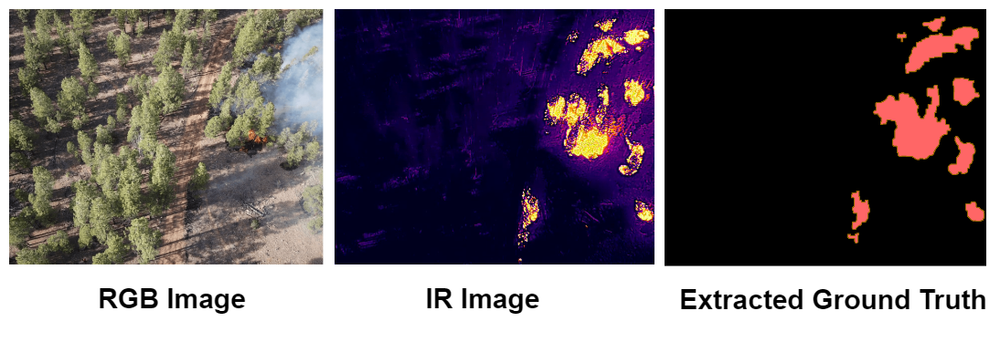

# Obscured-Wild-Fire-Detection
Welcome to the GitHub repository for our work on wildfire management using Deep Learning! 
In this project, we present a novel approach to detect both visible and obscured fires by harnessing the power of Deep Learning, 
specifically focusing on joint spatial and temporal analysis of RGB videos. Unlike conventional methods that independently analyze 
images and individual video frames, our proposed frame-wise transformer architecture incorporates an attention mechanism between consecutive frames while preserving spatial information within each frame. This innovative approach allows us to capture temporal patterns of smoke motions, indicating obscured fire flames. We optimize temporal pattern lengths under various spatial resolutions to achieve superior performance while minimizing computational costs. To validate the applicability of our method in aerial image processing, we applied it to a curated version of the [FLAME2](http://ieee-dataport.org/open-access/flame-2-fire-detection-and-modeling-aerial-multi-spectral-image-dataset) dataset with dual-mode RGB/IR videos. Notably, our model is trained solely on RGB videos to cater to low-cost commercial drones equipped with regular cameras. 

### Updates:

This work has been published in [DCOSS-IOT2024](https://dcoss.org/dcoss24/)

Paper link
https://ieeexplore.ieee.org/abstract/document/10621462
### Transformer based architecture for segmenting obscured file locations in videos

<div align="center">
  
</div>

### Usage


#### Installation
```
conda env create -f environment.yaml

conda activate cu102_v1 
```
you can modify environment name in yaml file

#### Ground-Truth extraction
Conversion of Infra-Red image to binary label of fire locations:

<div align="center">
  
</div>

Image Processing steps: IR Image → Smooth Image (5 × 5 AvgPool) → Hard
Thresholding → Dilation (5×5, 2 times) → Fill (flood fill) →
Erosion (5 × 5, 1 time) → Remove small objects (200 pixel)
→ Ground Truth.

```
from code.preprocessing import preprocessing

ground_truth = preprocessing.IR2Label(input_image_array)
```
###

#### Training
 
```
python train.py
```
parameters has to be tuned in the file itself

#### Inference

```
python infer.py
```

PS: This repository is half baked, more customization will be brought very soon..... Thank Youuuu.
